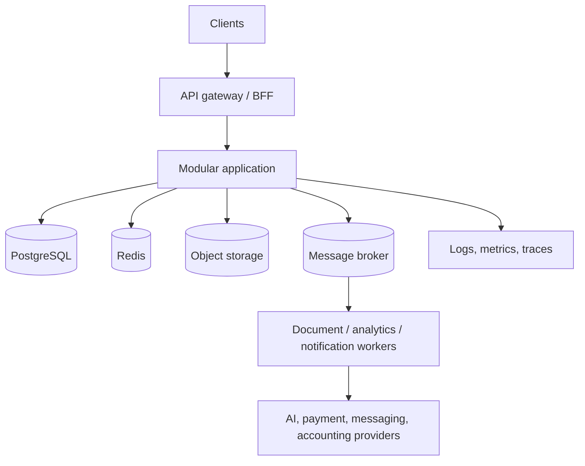

# Architecture

## Target shape

Start as a modular monolith with strict module boundaries, a shared PostgreSQL cluster, object storage, a broker, and worker processes. Deploy independently only the workloads that demonstrate a clear need: document processing, analytics, and notifications are likely first candidates.

## Boundaries

The API, domain, infrastructure, and worker layers are separated. Modules communicate through public application interfaces or events, not direct access to another module's tables. Every external integration has timeout, retry, idempotency, and provider-error mapping rules.
