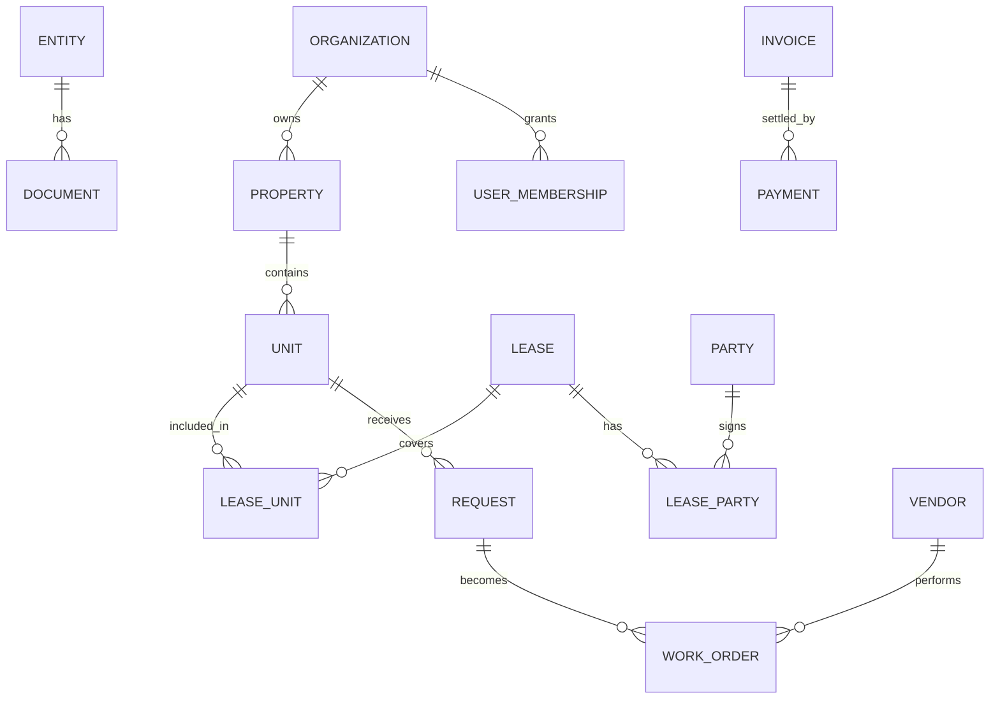

# ERD

All business tables include a stable identifier, organization scope where applicable, created/updated timestamps, and optimistic-concurrency metadata. Financial records are append-oriented; corrections use reversals rather than destructive edits.
