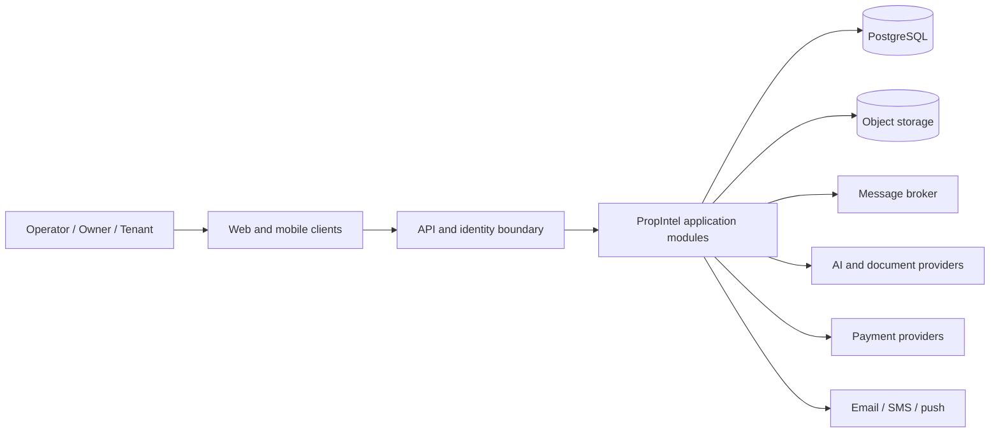
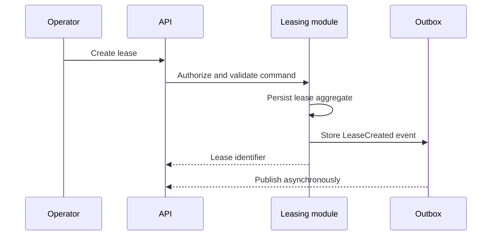

# UML

The following diagrams are logical specifications and can be rendered by Mermaid-compatible tooling.

## Context diagram

```mermaid
flowchart LR
  User[Operator / Owner / Tenant] --> UI[Web and mobile clients]
  UI --> API[API and identity boundary]
  API --> Core[PropIntel application modules]
  Core --> DB[(PostgreSQL)]
  Core --> Files[(Object storage)]
  Core --> Bus[Message broker]
  Core --> AI[AI and document providers]
  Core --> Pay[Payment providers]
  Core --> Notify[Email / SMS / push]
```

## Lease command sequence

```mermaid
sequenceDiagram
  participant U as Operator
  participant A as API
  participant L as Leasing module
  participant O as Outbox
  U->>A: Create lease
  A->>L: Authorize and validate command
  L->>L: Persist lease aggregate
  L->>O: Store LeaseCreated event
  L-->>A: Lease identifier
  O-->>A: Publish asynchronously
```
